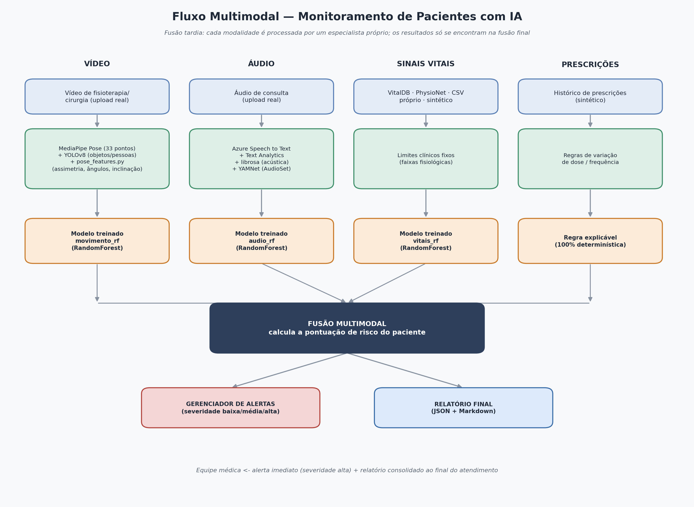

# Monitoramento Multimodal de Pacientes com IA

Tech Challenge — Fase 4 (Pós-Tech / FIAP).

Sistema que monitora pacientes internados combinando três fontes de dados —
**vídeo** (postura e objetos em cena), **áudio** (transcrição, características
da fala e eventos sonoros) e **sinais vitais** (séries temporais clínicas) —
para identificar sinais precoces de risco e gerar alertas automáticos para a
equipe médica. Inclui o
**treinamento dos modelos do zero** (conjunto de dados → treino → métricas →
modelo salvo), todos os **vídeos e áudios de treino/teste versionados como
arquivos reais no repositório** (nada é inventado só em memória), um
**frontend** completo para demonstrar tudo funcionando e suporte a **Docker**.

## Sumário

- [Como o problema foi resolvido](#como-o-problema-foi-resolvido)
- [Fluxo da arquitetura](#fluxo-da-arquitetura)
- [Fontes de dados utilizadas](#fontes-de-dados-utilizadas)
- [Estrutura do projeto](#estrutura-do-projeto)
- [Pré-requisitos](#pré-requisitos)
- [Instalação](#instalação)
- [Como rodar](#como-rodar)
- [Treinando os modelos](#treinando-os-modelos)
- [Configurando o Azure](#configurando-o-azure-speech-to-text--text-analytics)
- [Configurando o Relatório Final com OpenAI](#configurando-o-relatório-final-com-openai)
- [Testes](#testes)
- [Limitações conhecidas](#limitações-conhecidas-transparência--funciona-mágico)
- [Licença](#licença-de-uso-do-desafio)

## Como o problema foi resolvido

Cada modalidade tem seu próprio "especialista" (um módulo focado só naquele
tipo de dado), e os achados de todos eles só se encontram no final, na
**fusão multimodal**, que calcula uma pontuação de risco única por paciente e
decide os alertas. Essa escolha (fusão tardia, em vez de misturar tudo num
modelo só) torna cada peça testável e explicável isoladamente — importante
num contexto clínico, onde "por que o sistema alertou isso" precisa ter
resposta clara.

Os três "modelos treinados" principais (sinais vitais, movimento e voz) são
`RandomForestClassifier` do scikit-learn, treinados por scripts próprios em
`src/training/` e salvos em `models/*.joblib` — nada é treinado "na hora" a
cada execução. Para vídeo, cada janela de frames é resumida em 8 atributos
clínicos explicáveis (assimetria de ombros/quadril, ângulos de joelho e
cotovelo, inclinação de tronco, velocidade — ver `src/video/pose_features.py`),
não só a velocidade de um ponto isolado; cada alerta de movimento já vem com
os "motivos" que o geraram. Há ainda modelos **alternativos**, treinados
sobre dados reais em vez de sintéticos: sinais vitais com sinal real do
PhysioNet (MIT-BIH), movimento com vídeos reais de postura normal (sintéticos
gerados por código ou reais do Kaggle) e voz com embeddings do YAMNet
extraídos de áudios reais. Detalhes de cada modelo, como o treino foi feito e
os resultados obtidos estão em
[`docs/relatorio_tecnico.md`](docs/relatorio_tecnico.md).

## Fluxo da arquitetura



Cada modalidade entra por um caminho independente (captura/upload → técnica
de extração → modelo treinado daquela modalidade) e só se encontra no bloco
de **fusão multimodal**, que calcula a pontuação de risco final e aciona o
gerenciador de alertas e o gerador de relatório. Essa separação é o que
permite testar e explicar cada modalidade sozinha, sem depender das outras.

## Fontes de dados utilizadas

O projeto combina dados **sintéticos gerados por código** (garantem que tudo
rode de ponta a ponta sem depender de internet ou credenciais) com **fontes
de dados reais e públicas** (usadas nos treinos/validações alternativos).
Todo arquivo usado em treino ou teste — sintético ou real — já vem incluído
dentro da pasta `amostras/` do repositório; nenhum vídeo/áudio "existe só na
memória" durante a execução.

### Dados sintéticos gerados por código (usados no fluxo principal)

| Fonte | O que é | Onde é gerado | Onde fica |
|---|---|---|---|
| Sinais vitais sintéticos | Séries de FC/SpO2/PA com anomalias injetadas e rotuladas | `src/dados/dados_sinteticos.py` | em memória, no treino (`treinar_modelo_vitais.py`) |
| Vídeos de postura sintéticos | 3 vídeos de "pessoa" desenhada com OpenCV (círculo + elipse + linhas) se movendo, detectável pelo MediaPipe Pose | `src/dados/gerar_amostras_video_audio.py` | `amostras/videos_normais/*.mp4`, `amostras/video_exemplo_com_anomalia.mp4` (arquivos reais, já gerados e versionados) |
| Áudios sintéticos por classe | 10 áudios curtos (5 normais + 5 alterados), tons/ruído sintetizados por código | `src/dados/gerar_amostras_video_audio.py` | `amostras/audio_por_classe/{normal,alterado}/*.wav` (arquivos reais, já gerados e versionados) |
| CSV de sinais vitais de exemplo | 6 linhas com uma anomalia clara de FC/SpO2 | escrito à mão | `amostras/sinais_vitais_exemplo.csv` |

### Dados reais e públicos (usados nos treinos/validações alternativos)

| Fonte | O que é | Link | Como é usada aqui |
|---|---|---|---|
| **VitalDB** | Base pública de sinais vitais intraoperatórios reais (FC, SpO2, PA contínua) de pacientes de verdade | https://vitaldb.net/ | `src/dados/carregador_vitaldb.py` baixa um caso real para **validar** o modelo já treinado (`--dados-reais`) |
| **PhysioNet — VitalDB mirror** | Espelho do VitalDB no PhysioNet | https://physionet.org/content/vitaldb/1.0.0/ | fonte alternativa de acesso ao mesmo dado |
| **PhysioNet — BIDMC** | Sinais vitais de UTI reais (FC, SpO2, respiração) | https://physionet.org/content/bidmc/1.0.0/ | `src/dados/carregador_physionet.py`, fallback quando o VitalDB não está acessível |
| **PhysioNet — MIT-BIH Arrhythmia** | Sinal de ECG/FC real, de pacientes com e sem arritmia | https://physionet.org/content/mitdb/1.0.0/ | `src/training/treinar_modelo_vitais_physionet.py` treina um `IsolationForest` **não supervisionado** direto sobre FC real |
| **Kaggle — Physiotherapy** | Vídeos reais de sessões de fisioterapia (pacientes de verdade) | https://www.kaggle.com/datasets/toobasaeed11/physiotherapy | `src/dados/baixar_kaggle_fisioterapia.py` baixa via `kagglehub` para `amostras/videos_kaggle_fisioterapia/raw/`; `src/training/treinar_modelo_movimento_real.py --pasta amostras/videos_kaggle_fisioterapia/raw` treina um `IsolationForest` real sobre eles |
| **AudioSet (via YAMNet)** | Maior base de eventos sonoros rotulados do mundo (não distribui os áudios brutos, só metadados) | https://research.google.com/audioset/ | usamos o **YAMNet**, rede já treinada pelo Google direto no AudioSet completo, para classificar eventos sonoros sem baixar o conjunto bruto |
| **YAMNet (TensorFlow Hub)** | Modelo pré-treinado que classifica áudio em 521 classes do AudioSet | https://tfhub.dev/google/yamnet/1 | `src/audio/audioset_eventos.py` (classificação de eventos) e `src/training/treinar_modelo_audio_real.py` (embeddings de 1024-d para treinar um `RandomForest` sobre áudios reais) |
| **Azure Speech to Text** | Transcrição de fala em texto | https://azure.microsoft.com/products/ai-services/ai-speech | `src/audio/transcriber.py` |
| **Azure Text Analytics** | Sentimento e termos críticos no texto transcrito | https://azure.microsoft.com/products/ai-services/ai-language | `src/audio/text_analyzer.py` |
| **MediaPipe Pose** | Extração de 33 pontos-chave do corpo humano a partir de vídeo | https://developers.google.com/mediapipe/solutions/vision/pose_landmarker | `src/video/pose_analyzer.py` — usado no lugar do OpenPose sugerido no enunciado (mesmo propósito, mais leve) |
| **YOLOv8 / Ultralytics (COCO)** | Detecção de objetos em cena, pré-treinado no dataset COCO | https://github.com/ultralytics/ultralytics | `src/video/object_detector.py` |

## Estrutura do projeto

```
src/
  video/       postura completa (MediaPipe), atributos clínicos explicáveis
               (pose_features.py: assimetria/ângulos/inclinação/velocidade),
               detecção de objetos (YOLOv8) e geração de vídeo anotado
  audio/       transcrição (Azure Speech), análise de texto (Azure Text
               Analytics), acústica (librosa) e eventos sonoros + embeddings
               (YAMNet, treinado no AudioSet de verdade)
  anomalies/   detectores de anomalia (vitais, movimento) — usam
               os modelos treinados e/ou regras de fallback com "motivos"
  fusion/      fusão multimodal e cálculo da pontuação de risco final
  dados/       carregamento de dados reais (VitalDB / PhysioNet), download do
               dataset Kaggle, geração de dados sintéticos e geração dos
               vídeos/áudios de exemplo usados em treino e testes
  reports/     geração do relatório final (JSON + Markdown)
  training/    scripts de TREINO dos modelos (conjunto de dados, treino,
               avaliação, persistência) — um script por modelo, mais os
               alternativos treinados sobre dados reais
  main.py      orquestrador / linha de comando
frontend/
  app.py       frontend Streamlit (cadastro do atendimento, abas de análise
               por modalidade + visão geral + treinamento ao vivo)
models/        modelos já treinados (.joblib) + métricas (.json) — vêm
               prontos no repositório, não é preciso treinar antes de rodar
tests/         testes automatizados (pytest)
docs/          relatório técnico, roteiro do vídeo de demonstração e o
               diagrama de arquitetura (fluxo_arquitetura.png)
amostras/      TODO arquivo usado em treino/teste já vem pronto aqui:
  sinais_vitais_exemplo.csv        CSV de exemplo com anomalia
  videos_normais/                  3 vídeos sintéticos de postura normal
  video_exemplo_com_anomalia.mp4   1 vídeo sintético com anomalia
  audio_por_classe/normal/         5 áudios sintéticos normais
  audio_por_classe/alterado/       5 áudios sintéticos alterados
  videos_kaggle_fisioterapia/      vídeos reais do Kaggle (baixados sob
                                    demanda; a pasta raw/ não é versionada
                                    por ser grande, só o manifesto.json)
Dockerfile, docker-compose.yml     para rodar o frontend em container
.env.example                       modelo do arquivo de credenciais Azure
requirements.txt                   dependências Python
```

## Pré-requisitos

- Python 3.10 ou 3.11 (o projeto foi testado nessas versões)
- pip
- Opcional: Docker + Docker Compose (para rodar em container)
- Opcional: conta no [Azure](https://azure.microsoft.com/) com os serviços
  Speech e Text Analytics ativados (o sistema funciona sem isso, só pula a
  etapa de transcrição/análise de texto)
- Opcional: conta no [Kaggle](https://www.kaggle.com/) com autenticação
  configurada (só necessário se quiser baixar o dataset real de fisioterapia)

## Instalação

```bash
git clone <url-do-repositorio>
cd hospital-monitor-ia

python -m venv .venv
source .venv/bin/activate        # Windows: .venv\Scripts\activate

pip install -r requirements.txt
```

A instalação já traz tudo pronto para rodar a demo completa (frontend, CLI,
treino com dados sintéticos e com os vídeos/áudios já incluídos em
`amostras/`) sem precisar de nenhuma credencial ou download extra. Azure e
Kaggle são só para os caminhos opcionais com dados reais externos.

## Como rodar

### Opção 1 — Frontend (recomendado para demonstração)

```bash
streamlit run frontend/app.py
```

Abre em `http://localhost:8501` uma página com: cadastro do atendimento na
barra lateral, aba **Visão Geral** (relatório consolidado com download em
JSON), **Sinais Vitais** (dados sintéticos, CSV próprio ou o exemplo
incluído, ou caso real do VitalDB), **Vídeo** (upload real, gera vídeo
anotado com esqueleto/caixas/alertas e lista os "motivos" de cada evento de
movimento anômalo — ex: "assimetria de ombros", "inclinação excessiva do
tronco"), **Áudio** (upload real, com eventos sonoros do YAMNet/AudioSet),
**Treinamento** (treina os modelos ao vivo com métricas na tela, incluindo os
alternativos sobre dados reais e o botão para baixar os vídeos do Kaggle —
útil para gravar o vídeo de demonstração pedido no desafio; roteiro sugerido
em [`docs/roteiro_video.md`](docs/roteiro_video.md)).

### Opção 2 — Docker

```bash
cp .env.example .env      # edite com suas chaves Azure, se tiver
docker compose up --build
```

Sobe o mesmo frontend Streamlit em `http://localhost:8501`, com `models/` e
`reports/` montados como volumes (modelos treinados e relatórios gerados
persistem fora do container).

### Opção 3 — Linha de comando

```bash
python -m src.main --demo                                              # dados sintéticos
python -m src.main --demo --dados-reais                                # tenta VitalDB/PhysioNet reais
python -m src.main --csv amostras/sinais_vitais_exemplo.csv            # sinais vitais de um CSV próprio
python -m src.main --demo --video amostras/videos_normais/normal_1.mp4 # vídeo real
python -m src.main --demo --audio amostras/audio_por_classe/normal/normal_1.wav  # áudio real
```

Cada execução gera um relatório em `reports/<id>_<timestamp>.{json,md}`.

#### Sinais vitais a partir de um CSV próprio

`amostras/sinais_vitais_exemplo.csv` é um exemplo pronto (6 linhas, com uma
anomalia clara de frequência cardíaca/SpO2 na quarta linha) para testar sem
precisar gerar nada. `src/dados/carregador_csv.py` aceita qualquer CSV com
colunas de sinais vitais em português ou inglês
(`heart_rate`/`frequencia_cardiaca`, `spo2`,
`systolic_bp`/`pressao_sistolica`, `diastolic_bp`/`pressao_diastolica`,
`timestamp`) — tanto pelo frontend (aba Sinais Vitais → "Enviar arquivo CSV")
quanto por `--csv caminho.csv` na linha de comando.

## Treinando os modelos

Os modelos já vêm treinados em `models/*.joblib` — não é obrigatório
retreinar para rodar a demo. Para treinar do zero:

```bash
python -m src.training.treinar_tudo
```

Roda as 5 etapas de cada modelo principal (construir conjunto de dados →
separar treino/teste → treinar → avaliar → salvar) e imprime
acurácia/precisão/recall/F1 de cada um. Também dá para treinar cada modelo
individualmente:

```bash
python -m src.training.treinar_modelo_vitais       # RandomForest, dados sintéticos rotulados
python -m src.training.treinar_modelo_movimento    # RandomForest, dados sintéticos rotulados
python -m src.training.treinar_modelo_audio        # RandomForest, dados sintéticos rotulados
```

### Modelos alternativos, treinados sobre dados reais

```bash
# Sinais vitais: IsolationForest não supervisionado sobre FC real do MIT-BIH (PhysioNet)
python -m src.training.treinar_modelo_vitais_physionet

# Movimento: IsolationForest não supervisionado sobre vídeos reais
# (usa por padrão os vídeos sintéticos já incluídos em amostras/videos_normais/)
python -m src.training.treinar_modelo_movimento_real

# Movimento com vídeos REAIS de fisioterapia do Kaggle (opcional, requer
# conta no Kaggle com autenticação configurada — ver instruções abaixo):
python -m src.dados.baixar_kaggle_fisioterapia
python -m src.training.treinar_modelo_movimento_real --pasta amostras/videos_kaggle_fisioterapia/raw

# Voz: RandomForest sobre embeddings do YAMNet extraídos de áudios reais
# (usa por padrão amostras/audio_por_classe/<classe>/)
python -m src.training.treinar_modelo_audio_real
```

**Autenticação no Kaggle** (só necessária para `baixar_kaggle_fisioterapia.py`):
aceite as condições do dataset em
https://www.kaggle.com/datasets/toobasaeed11/physiotherapy e configure a
autenticação (arquivo `kaggle.json` ou variáveis de ambiente
`KAGGLE_USERNAME`/`KAGGLE_KEY`) seguindo
https://github.com/Kagglehub/kagglehub#authenticate. Sem isso, ou sem
internet, o script falha com uma mensagem clara em vez de travar — o projeto
continua funcionando normalmente com os vídeos sintéticos já incluídos.

Os modelos treinados vão para `models/*.joblib`, junto com um `.json` de
métricas. Veja [`docs/relatorio_tecnico.md`](docs/relatorio_tecnico.md) para
o racional completo (por que dados sintéticos, por que RandomForest/
IsolationForest, resultados obtidos em cada modelo).

## Configurando o Azure (Speech to Text + Text Analytics)

```bash
cp .env.example .env
# edite o .env com suas chaves:
#   AZURE_SPEECH_KEY, AZURE_SPEECH_REGION
#   AZURE_TEXT_ANALYTICS_KEY, AZURE_TEXT_ANALYTICS_ENDPOINT
```

Sem essas chaves, o pipeline de áudio ainda roda — só pula a etapa de
transcrição/análise de texto e segue com o modelo treinado de voz + os
eventos sonoros do YAMNet + os indicadores acústicos, deixando um aviso claro
no relatório final.

## Configurando o Relatório Final com OpenAI

Para gerar o parecer final com pontuação de saúde de 0 a 10 (0 = muito ruim,
10 = muito saudável), item de maior risco e alerta objetivo para equipe
médica, configure no `.env`:

```bash
# obrigatório
OPENAI_API_KEY=...

# opcional (default no projeto: gpt-4.1-mini)
OPENAI_MODEL=gpt-4.1-mini

# opcional: fallback automático quando houver rate limit/token limit
OPENAI_FALLBACK_MODEL=gpt-4o-mini
```

Sem `OPENAI_API_KEY`, o sistema continua gerando o relatório consolidado
normal, mas sem o bloco "Parecer Final (OpenAI)".

## Testes

```bash
pytest tests/ -v
```

27 testes, cobrindo os detectores de anomalia, os atributos clínicos de pose
(assimetria/ângulos/motivos), a fusão multimodal (inclusive os eventos do
AudioSet), o pipeline de treino (conjunto de dados + treino + avaliação,
incluindo a consistência de esquema entre o treino sintético e o treino com
vídeos reais), a geração do vídeo anotado e o carregamento de CSV externo —
tudo o que não depende de rede, GPU ou credenciais Azure/Kaggle, e por isso
roda em qualquer máquina, em segundos.

## Limitações conhecidas (transparência > "funciona mágico")

- **Treino com dados sintéticos, validação com dados reais**: os modelos
  principais são treinados com dados sintéticos rotulados (a anomalia é
  injetada por código, então o rótulo é sempre confiável). Nem VitalDB, nem
  AudioSet, nem o dataset do Kaggle trazem rótulo de anomalia pronto para
  treino supervisionado — exigiria anotação clínica manual, fora do escopo
  desta entrega. Por isso essas fontes são usadas para **validar** ou treinar
  modelos **não supervisionados** (que só precisam ver exemplos "normais").
  Ver a seção 4 do relatório técnico para o racional completo.
- **AudioSet via YAMNet**: como o Google AudioSet não distribui os arquivos
  de áudio (só metadados/IDs de vídeos do YouTube), usamos o **YAMNet** —
  rede já treinada pelo Google diretamente no AudioSet completo, distribuída
  via TensorFlow Hub — para classificar eventos sonoros. Requer
  `tensorflow`/`tensorflow-hub` instalados e internet na primeira execução (o
  modelo fica em cache local depois); se indisponível, o pipeline de áudio
  segue normalmente sem essa etapa.
- **OpenPose → MediaPipe Pose**: o enunciado sugere OpenPose; usamos
  MediaPipe Pose pelo mesmo propósito (extração de pontos-chave do corpo),
  por ser leve e sem dependência de compilação C++/CUDA.
- **Dataset do Kaggle é opcional e não versionado**: por ser potencialmente
  grande e sujeito à licença do autor no Kaggle, os vídeos baixados não vão
  para o repositório (só o `manifesto.json` com o inventário) — cada pessoa
  baixa a sua própria cópia rodando `baixar_kaggle_fisioterapia.py`. O
  projeto funciona de ponta a ponta sem isso, usando os vídeos sintéticos já
  incluídos em `amostras/videos_normais/`.
- **Pressão arterial**: quando cai no fallback do PhysioNet/BIDMC (sem
  VitalDB), a pressão arterial é estimada por correlação simples com a FC, já
  que o BIDMC não traz pressão contínua nos arquivos abertos. Com o VitalDB
  (fonte primária agora), a pressão arterial é real.
- **Acurácia de 100% nos modelos supervisionados**: as anomalias sintéticas
  são injetadas com uma diferença grande o suficiente para ficarem bem
  separáveis — isso valida que o *pipeline* de treino funciona corretamente,
  mas não deve ser lido como "o modelo é perfeito em dados reais". Detalhes
  em `docs/relatorio_tecnico.md`.
- **Modelo de movimento treinado com dados sintéticos generaliza pior para
  vídeo real**: o `movimento_rf` (treinado só com pontos sintéticos limpos)
  tende a ser mais sensível ao ruído de detecção do MediaPipe em vídeo real
  do que o `movimento_isolationforest_real` (treinado direto sobre vídeos
  reais) — um exemplo concreto de por que os dois caminhos de treino
  (sintético supervisionado + real não supervisionado) se complementam. Ver
  seção 4.6 do relatório técnico.

## Licença de uso do desafio

Projeto acadêmico — Tech Challenge Fase 4, Pós-Tech.
